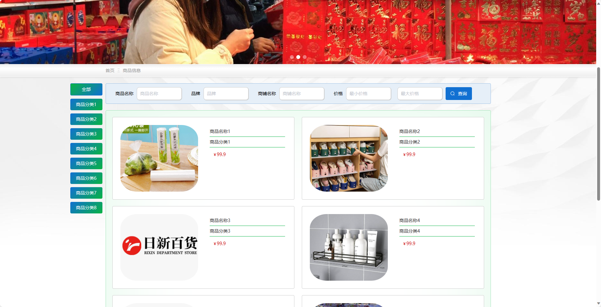
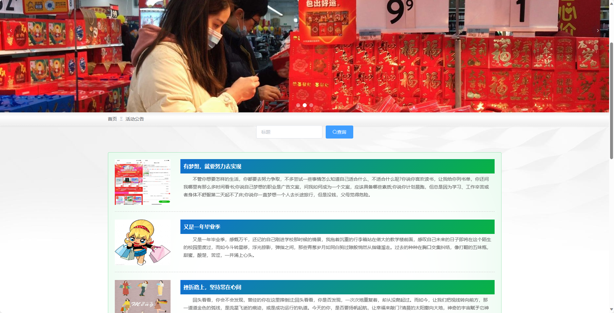
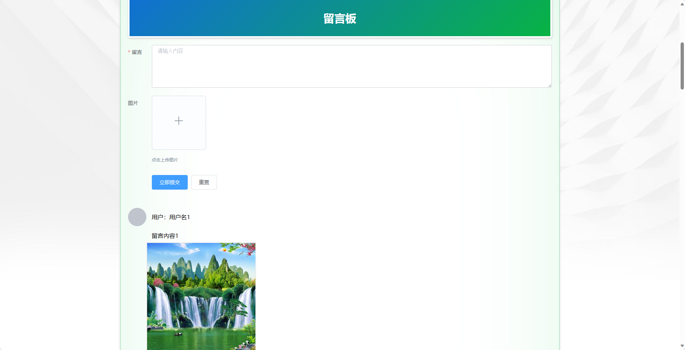
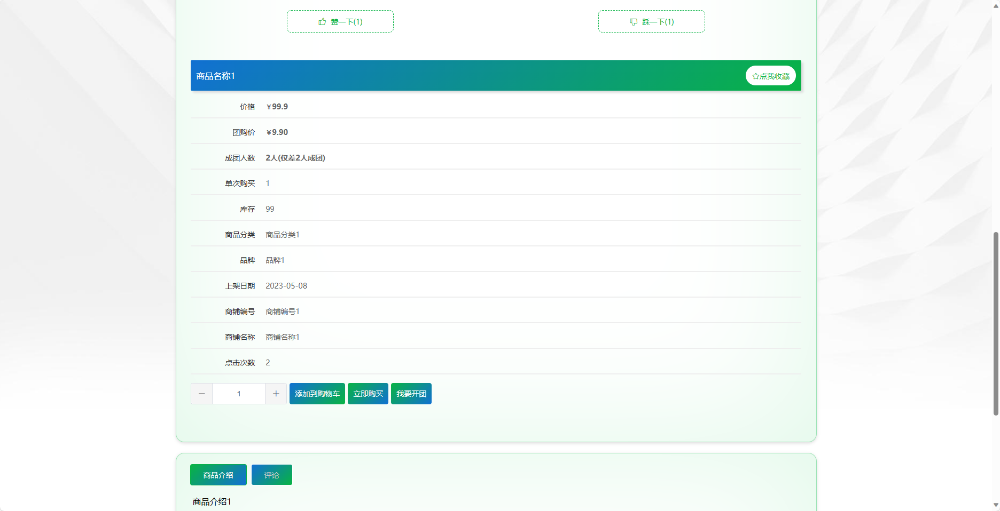
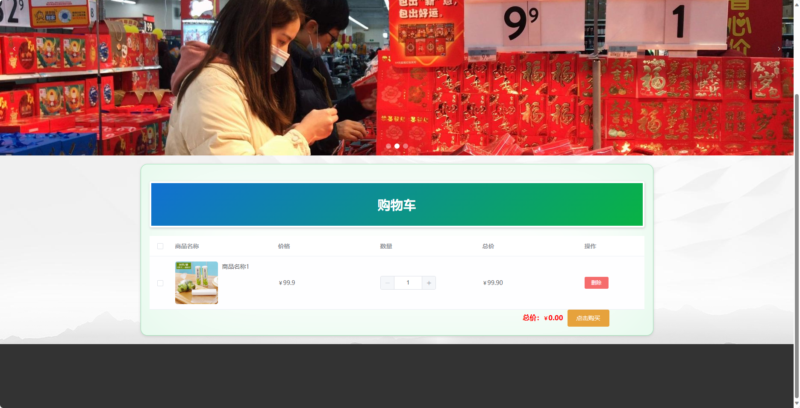
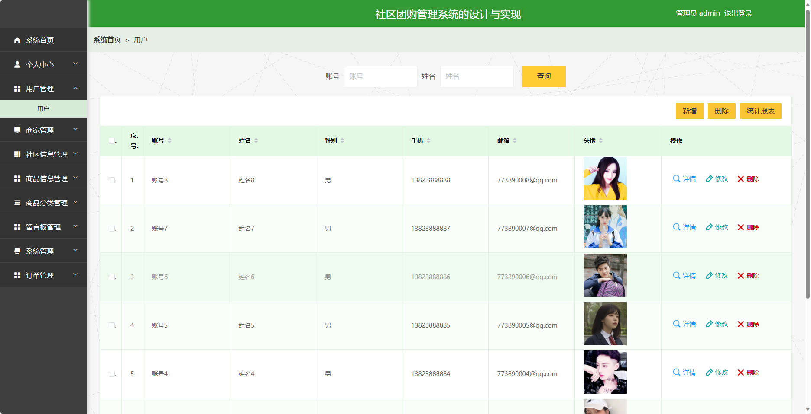
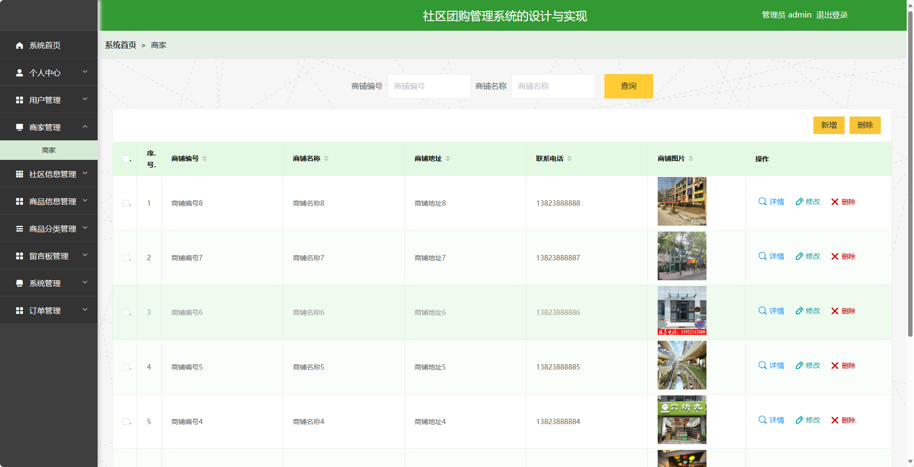
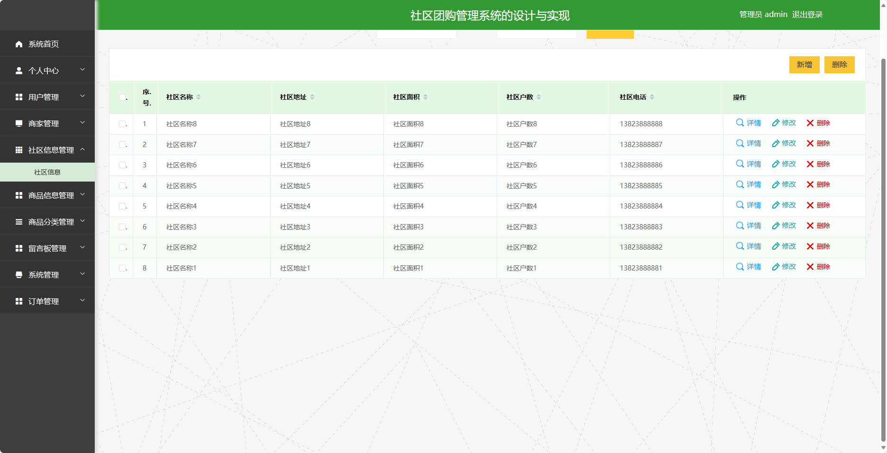
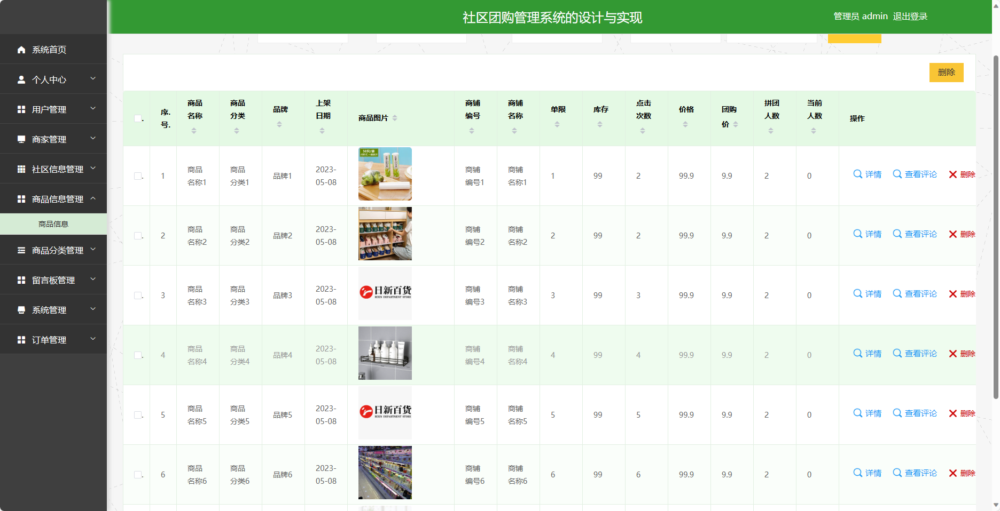

基于SpringBoot的社区团购管理系统
=
- 完整代码获取地址：从戎源码网 ([https://armycodes.com/](https://armycodes.com/))
- 作者微信：19941326836  QQ：952045282 
- 承接计算机毕业设计、Java毕业设计、Python毕业设计、深度学习、机器学习
- 选题+开题报告+任务书+程序定制+安装调试+论文+答辩ppt 一条龙服务
- 所有选题地址https://github.com/nature924/allProject

一、项目介绍
---
基于Spring Boot框架实现的社区团购管理系统，系统包含两种角色：管理员、用户,系统分为前台和后台两大模块，主要功能如下。

### 前台：
- 首页：展示系统的概览信息。
- 商品信息：展示各类商品的详细信息。
- 活动公告：展示系统发布的团购活动信息。
- 留言板：用户可以在留言板上发表评论、提问。
- 购物车：用户可以将感兴趣的商品加入购物车。
- 个人中心：用户可以登录后进入个人中心，管理个人信息、查看订单记录等。

### 后台：
### 管理员角色：
- 个人中心：管理员可以管理个人信息，修改密码等。
- 用户管理：管理员可以管理系统的用户账号信息，包括添加、编辑、删除等操作。
- 商家管理：管理员可以管理系统的商家账号信息，包括添加、编辑、删除等操作。
- 社区信息管理：管理员可以管理系统的社区信息，包括添加、编辑、删除等操作。
- 商品信息管理：管理员可以管理系统的商品信息，包括添加、编辑、删除等操作。
- 商品分类管理：管理员可以管理系统的商品分类信息，包括添加、编辑、删除等操作。
- 留言板管理：管理员可以管理留言板上的评论、问题等，包括审核、删除等操作。
- 系统管理：管理员可以管理系统的一些通用配置，例如系统参数设置、广告轮播图等。
- 订单管理：管理员可以管理用户的订单信息，包括查看、处理、取消订单等操作。

### 商家角色：
- 个人中心：商家可以管理个人信息，修改密码等。
- 商品信息管理：商家可以管理自己的商品信息，包括添加、编辑、删除等操作。
- 订单管理：商家可以管理自己的订单信息，包括查看、处理、取消订单等操作。

二、项目技术
---
- 编程语言：Java
- 数据库：MySQL
- 项目管理工具：Maven
- 前端技术：VUE、HTML、Jquery、Bootstrap
- 后端技术：Spring、SpringMVC、MyBatis

三、运行环境
---
- 操作系统：Windows、macOS都可以
- JDK版本：JDK1.8以上都可以
- 开发工具：IDEA、Ecplise、Myecplise都可以
- 数据库: MySQL5.7以上都可以
- Tomcat：任意版本都可以
- Maven：任意版本都可以

四、运行截图
---
### 程序截图：

